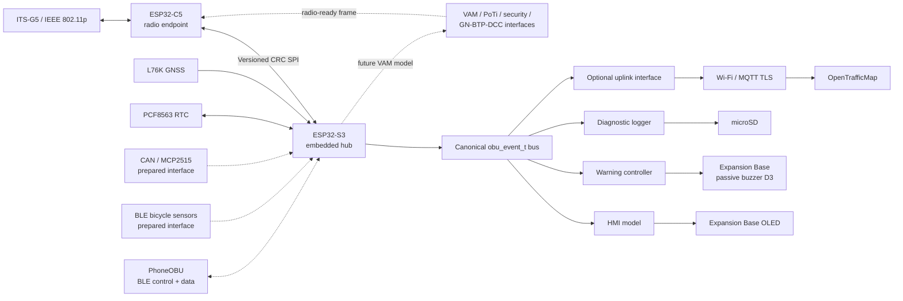

# MainboardOBU Prototype

[](https://github.com/niklasdathe/MainboardOBU-prototype/actions/workflows/build.yml)

Reusable ESP-IDF firmware for the BicycleOBU prototype mainboard. The ESP32-C5 is a dedicated ITS-G5 radio endpoint; the ESP32-S3 is the embedded hub for time, GNSS, local HMI/warnings, logging and future CAN/BLE sources.

This is a research prototype. Experimental safety and V2X-transmit functions are not certified and do not replace rider attention or regulatory compliance.

## Status

| Area | Current evidence |
|---|---|
| ESP32-C5 radio endpoint | ITS-G5 raw RX/TX boundary, metadata, bounded buffering, status and fail-safe per-boot TX arming implemented |
| ESP32-S3 hub | Canonical event bus, SPI link, GNSS/time, OLED, local buzzer, SD diagnostic logging and optional OTM uplink implemented |
| Local warning output | Expansion Base passive buzzer on A3/D3 (XIAO S3 GPIO4), asynchronous output, runtime mute boundary and warning-episode deduplication implemented |
| Hardware abstraction | Replaceable display, warning-output, radio, GNSS, uplink and standards interfaces; YAML hardware profiles validated at integration time |
| ETSI VAM conformance | Explicit codec/PoTi/security/GN-BTP-DCC gates exist; production implementations and HIL/RF verification remain pending |

Source review and a successful firmware build are not complete-system validation. RF, timing, endurance and warning acceptance tests still require hardware.

## Start here

| Goal | Guide |
|---|---|
| Understand the component split | [`docs/ARCHITECTURE.md`](docs/ARCHITECTURE.md) |
| Find the document for a development task | [`docs/README.md`](docs/README.md) |
| Check workbook coverage and open verification | [`docs/REQUIREMENT_TRACEABILITY.md`](docs/REQUIREMENT_TRACEABILITY.md) |
| Wire the Expansion Base prototype | [`docs/HARDWARE.md`](docs/HARDWARE.md) |
| Build and validate both MCUs | [`docs/DEVELOPMENT.md`](docs/DEVELOPMENT.md) |

## Architecture



The display and buzzer are consumers of the S3 data model, not owners of warning or acquisition logic. Replacing the OLED with an LVGL round-display driver, or replacing the Expansion Base buzzer with another audible/haptic actuator, does not change the source/event architecture.

## Hardware at a glance

| Function | Prototype hardware | S3 connection |
|---|---|---|
| OLED | Expansion Base SSD1306 | I²C D4/D5 |
| RTC | Expansion Base PCF8563 | shared I²C D4/D5 |
| Diagnostic storage | Expansion Base microSD | SPI D8/D9/D10, CS D2 |
| Audible warnings | Expansion Base passive buzzer | A3/D3 = GPIO4 |
| GNSS | XIAO L76K | UART D6/D7; PPS reserved on D12 |
| C5 link | XIAO ESP32-C5 | shared SPI, CS D0, DATA_READY D11 |

The unmodified XIAO CAN expansion uses D7 as MCP2515 CS, which conflicts with the selected L76K UART profile. Use a carrier/rerouted CS rather than blind stacking when both are fitted.

## Development workflow

```bash
python scripts/check_pin_plan.py config/hardware/prototype-expansion-base.yaml
python scripts/check_pin_plan.py config/hardware/round-display-carrier.yaml

idf.py -C firmware/c5 set-target esp32c5
idf.py -C firmware/c5 build

idf.py -C firmware/s3 set-target esp32s3
idf.py -C firmware/s3 menuconfig
idf.py -C firmware/s3 build
```

The S3 defaults to direct OpenTrafficMap upload **off**. The local warning buzzer defaults **enabled and unmuted** but exposes a runtime mute boundary; the final authenticated BLE control implementation can bind to that boundary without changing the warning driver.

## Source of truth

| Question | Source |
|---|---|
| System/acceptance requirements | `BicycleOBU_Requirements_v1_1_ETSI_VITS_S.xlsx` in the parent project |
| Prototype responsibilities and data flow | `docs/ARCHITECTURE.md` |
| Implemented/open requirement mapping | `docs/REQUIREMENT_TRACEABILITY.md` |
| Pin ownership and accessory conflicts | `config/hardware/*.yaml` + `scripts/check_pin_plan.py` |
| C5/S3 protocol | `components/obu_ipc/` |
| Warning-output contract | `components/obu_warning/` |
| CI compiler evidence | `.github/workflows/build.yml` and GitHub Actions |

## Safety and data rules

- The C5 boots receive-only; TX requires explicit arming for the current boot session.
- Missing or stale data must stay explicit; embedded code must not invent C-ITS or sensor values.
- Raw V2X bytes and acquisition/provenance timestamps are retained separately from derived state.
- Repeated receptions belonging to one active warning episode may update logs/display but must not repeatedly actuate the rider warning output when they share the same canonical notification ID.
- Display, buzzer, SD or uplink failure must not intentionally stop radio/GNSS/source acquisition.

## License

No project license has been selected. Until one is added, this repository must not be presented as granting software or documentation reuse rights.
