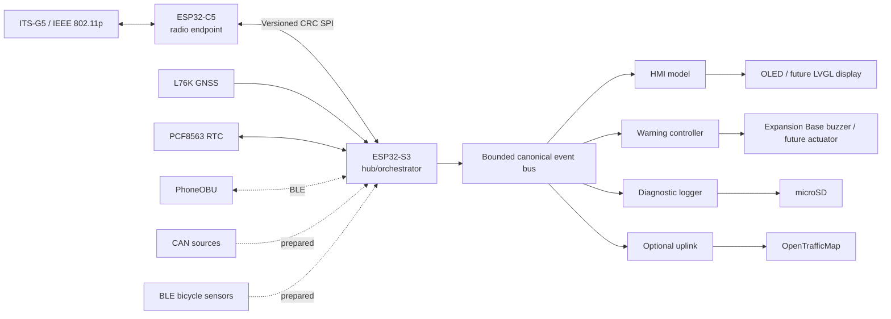

# Prototype architecture

## System view

## Responsibility split

### ESP32-C5

The C5 is a bounded, semantics-free radio endpoint. It captures 802.11p frames, attaches radio/acquisition metadata, forwards the bytes unchanged to the S3, accepts complete radio-ready TX frames, emits TX results, exposes radio/queue/reset status, and maintains a fail-safe RX-only boot state. It does not create bicycle semantics or decode facilities messages.

### ESP32-S3

The S3 owns the project data plane. Every source is normalized into `obu_event_t`, which carries source identity, data type, sequence, source acquisition time, UTC correlation quality, validity and provenance flags. Consumers subscribe with bounded queues. A slow display/logger/uplink therefore cannot block acquisition.

The S3 is also the home of the VBS/VAM service boundary. A standards codec, PoTi, security service and GeoNetworking/BTP/DCC stack are intentionally explicit dependencies. The policy layer shall suppress TX and log the reason when mandatory data or a conformance gate is absent.

## C5 ↔ S3 SPI contract

- S3: SPI master.
- C5: SPI slave.
- Full-duplex fixed maximum transaction.
- `OBU1` header, protocol version, message type, sequence, source timestamp and CRC-32.
- C5 `DATA_READY` line indicates queued C5→S3 data; S3 also polls periodically so status cannot deadlock on a lost edge.
- Message types include raw RX, radio status, TX request, TX result, TX-arm challenge, time probe/response and configuration acknowledgement.
- All application queues are fixed-length. Overflow increments a dedicated counter; no source blocks indefinitely.

The electrical transport is deliberately replaceable. The same message codec can sit over another physical bus on a later PCB.

## Time model

`esp_timer_get_time()` is the local acquisition clock. The S3 time service maintains an affine UTC anchor with an explicit quality enum (`UNSYNCED`, `RTC_HOLDOVER`, `GNSS`, `GNSS_PPS`). PCF8563 provides restart/temporary-GNSS-loss holdover. GNSS updates the RTC when UTC is valid. C5 timestamps stay C5-local in the radio record and are correlated on S3 via periodic four-timestamp time-probe exchanges. Each received radio record retains the radio hardware timestamp and C5 acquisition timestamp; the S3 stores a separate mapped hub-domain timestamp. Clock-offset, round-trip-time and sample-count records are emitted into the event bus so the achieved relationship can be recorded and characterized rather than assumed.

## HMI and warning outputs

Application logic renders only `obu_hmi_model_t`. The prototype SSD1306 driver maps that model onto the Expansion Base OLED. A future GC9A01/LVGL Round Display driver implements the same `obu_display_driver_t` interface.

Audible warnings are deliberately not part of the display driver. `obu_warning_controller_t` consumes canonical warning notifications and drives `obu_warning_output_t`. The Expansion Base passive buzzer driver uses PWM on A3/D3 and performs each tone in its own worker task so display rendering and beep duration cannot block the event consumer. The controller has a bounded recent-ID table for one audible episode per active canonical notification ID and exposes a mute boundary for future authenticated phone control. Display or warning-output initialization failure is non-fatal to source acquisition.

## Logging

The SD card is a diagnostic/fault recorder, not the canonical scientific ride log. `obu_diag_logger` writes bounded line-oriented records, rotates at a configured size, retains a configured number of files, flushes on error/fault events and exposes write/drop counters. Full raw scientific recording remains a phone/application responsibility per the requirements.

## OpenTrafficMap direct publisher extension

The workbook baseline only requires phone uplink and explicitly says the C5/S3 must not *require* their own Internet uplink. The optional S3 publisher therefore defaults off and is non-critical. It subscribes only to fresh raw RX events, publishes each frame as one MQTT payload, and drops while disconnected rather than buffering for catch-up. Networking exposes an `obu_uplink_t` boundary so another module can implement the network transport later. Wi-Fi/MQTT is implemented now. A LoRaWAN adapter can target the same boundary, although raw OTM traffic rates and LoRaWAN MTUs/duty-cycle constraints mean an unmodified LoRaWAN OTM path is generally not a practical substitute for IP/MQTT.

## Pin strategy

Build-time YAML is used for human-reviewed hardware profiles because pin assignments, optional boards and chip selects change often during prototyping. Firmware runtime configuration remains typed C/NVS; YAML is not parsed on-device. `scripts/check_pin_plan.py` catches exclusive-pin collisions while permitting declared shared I2C/SPI buses.

## Bicycle reference frame and sensor installation metadata

The canonical bicycle frame is right-handed with its origin at the centre of the rear-wheel axle: **+X forward, +Y left, +Z up**. Every spatial source shall either publish in this frame or carry a rigid transform into it. `obu_sensor_pose_t` stores translation, quaternion orientation, calibration revision and validity time; phone-side scientific provenance stores the full sensor identity/configuration alongside it.

## Configuration strategy

Configuration is split by lifetime:

- **YAML hardware profiles**: board/carrier wiring, pin ownership, I2C addresses, chip selects and mutually-exclusive accessory combinations.
- **Kconfig**: compile-time prototype features and safe defaults, including local buzzer policy and optional direct OTM development uplink.
- **Authenticated runtime control + NVS**: user/changeable settings such as radio channel, sensor rates, enabled sources, warning mute state, display policy and uploader endpoint. The BLE implementation is deferred, but its control/reply boundary is defined.
- **Phone/session provenance**: DBC definitions, sensor poses/calibrations, routing-provider/profile and research-session configuration remain phone-side.

Secrets should not be put in YAML committed to the repository. Current Kconfig Wi-Fi fields are development-only; production credentials belong in protected storage/provisioning.

## Prepared but deliberately unimplemented interfaces

`obu_ifaces` defines hardware/standards boundaries for CAN, generic sources, phone BLE/control acknowledgements, LDM, VAM encoding, PoTi, security and GeoNetworking/BTP/DCC. These interfaces allow missing implementations to be added as components without changing the canonical event model. Unknown CAN identifiers are represented as raw `obu_can_frame_t` records and can therefore pass to the phone unchanged; DBC interpretation stays out of embedded firmware.
